# Pharmacy manager

Попытка разработать ERP-систему для фармацевтического киоска.

Этот проект наглядное пособие как НЕ НАДО разрабатывать приложения на WPF.

Интерфейс был написан в попыхах за неделю до сдачи. Полный шлак(

## Название проекта
Программное обеспечение для автоматизации аптечного пункта

## Краткое описание идеи проекта
Разработать программное обеспечение (ПО), обеспечивающее централизованное управление справочником товаров,
фиксацию информации о приходе и отпуске товаров, управление ценообразованием и персоналом аптечного пункта. 

## Краткое описание предметной области
В качестве предметной области выбрано коммерческое предприятие (аптечный пункт), занимающееся продажей готовых лекарственных средств.

Процесс реализации начинается с получения товара от поставщика на основе накладных. Для поступления в продажу, поставленные товары должны быть одобрены заведующим аптечного пункта. Для этого, в первую очередь, они должны быть разгружены и помещены в требуемое место хранения. Далее на них устанавливается наценка (с учетом категории товара) и наносится маркировка с необходимой информацией. После этого они могут быть перемещены в подходящее место хранения. За время хранения товары могут быть списаны (например, по окончании срока хранения или по причине брака). Поступивший в продажу товар модет быть продан. 

Под обработкой понимается добавление, изменение и удаление данных о работающих сотрудниках, заказах (накладных), полученных, одобренных и списанных товарах, а также поставщиках, задействованных в поставках.

Под учетом подразумевается быстрый поиск информации по всем категориям товаров, присутствующим в базе данных. Например, по запросу категории или названия лекарственного средства должна выводиться соответствующая информация.

Контроль должен осуществляться над остатками нереализованных лекарственных средств: недопущение к продаже средств с истекшим сроком хранения, контроль минимального запаса средств и т.д.

Основные сущности и их атрибуты приведены на прилагаемой ER-диаграмме.

## Краткий анализ аналогичных решений по 3 критериям 
| Критерии\Наименование ПО |   Стандарт-Н  |   1С:Аптека   |   Трейд Фарм   |  Проект  |
| ------------------------ | ------------- | ------------- | -------------- | -------- |
| Отображение аналитической информации в виде графиков | - | + | - | + |
| Печать электронных документов (в т.ч. чеков, накладных и т.д) | - | + | + | - |
| Поддержка Linux/MacOS | - | + | - | + |
| FOSS | - | - | - | + |

## Краткое обоснование целесообразности и актуальности проекта 
Создаваемое программное обеспечение относится к программам для автоматизации производственных и бизнес процессов. Данное ПО позволяет сократить численность обслуживающего персонала, увеличить объем реализуемой продукции, повысить эффективность бизнес-процессов, улучшить качество обслуживания, снизить расходы на повторяющиеся операции, повысить экологичность и экономичность производства.

## Архитектурные характеристики, важные для проекта
- Возможность работы с наиболее распространенными СУБД. Данное требование обусловалено необходимостью обеспечить работу с уже созданными базами данных лекарственных средств

- Возможность сконфигурировать приложение под конкретного заказчика

## ER диаграмма
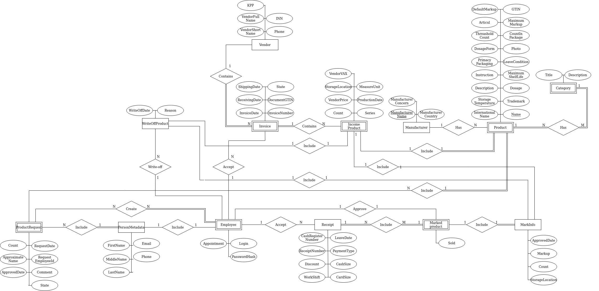

## Use-case диаграмма
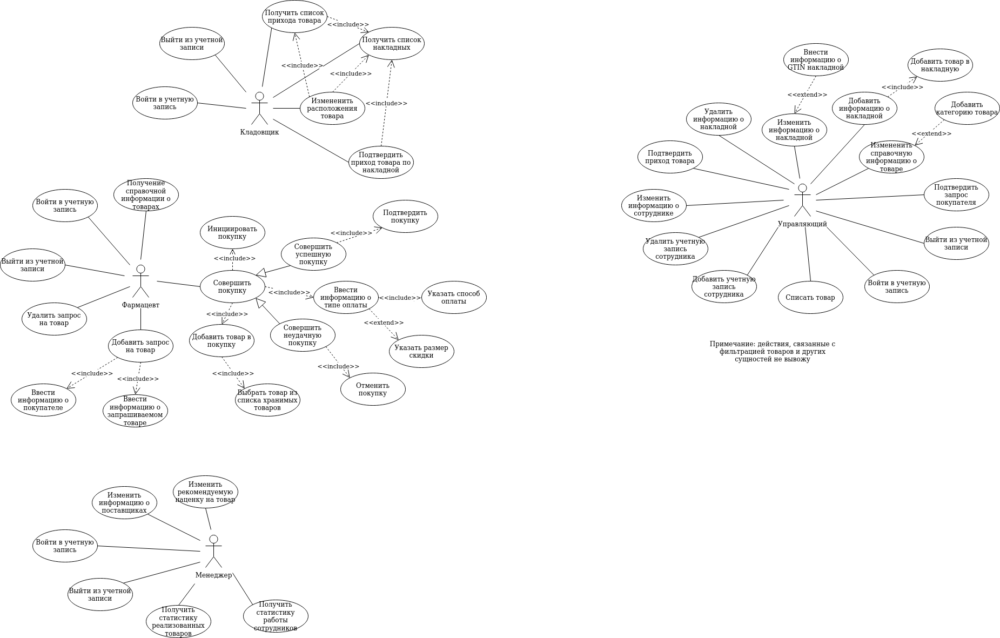

## Расширенная диаграмма компонентов

## UML-диаграмма классов компонента представления

## UML-диаграмма классов компонента модели представления

## Описание типа приложения и выбранного технологического стека
Тип приложения: Desktop

Выбранные инструменты:

    - Язык программирования: С#
    - СУБД: MS SQL Server

## Скрины

Страница авторизации

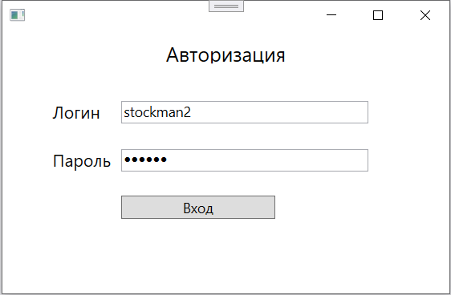

Список накладных и товаров, приобритенных по этим накладным (менеджер)

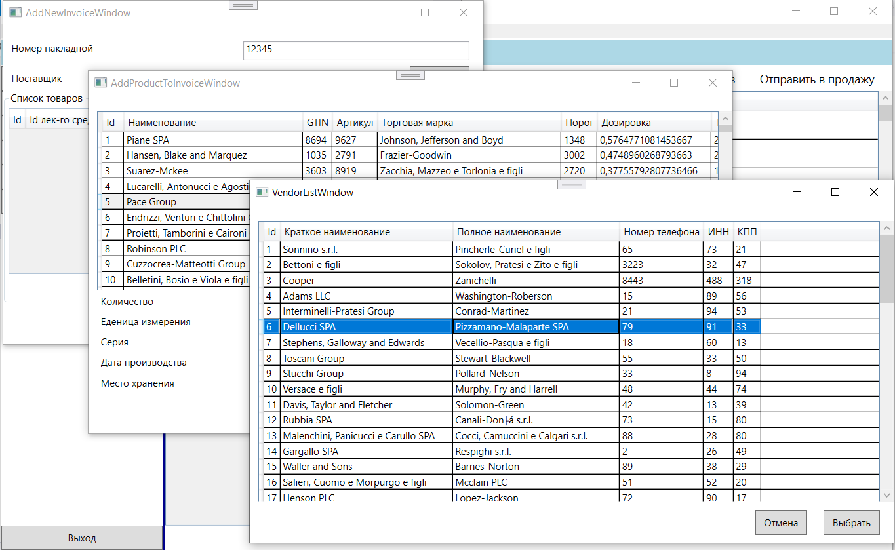

Страница с описанием товара (фармацевт)

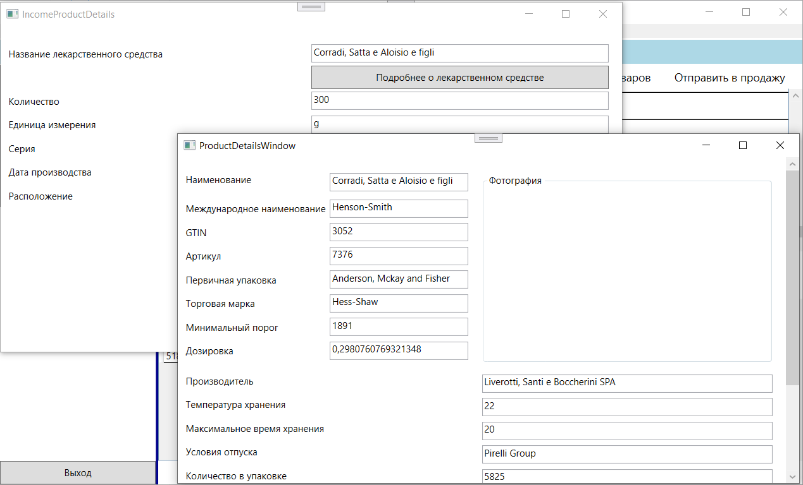

Страница регистрация персонала (менеджер)

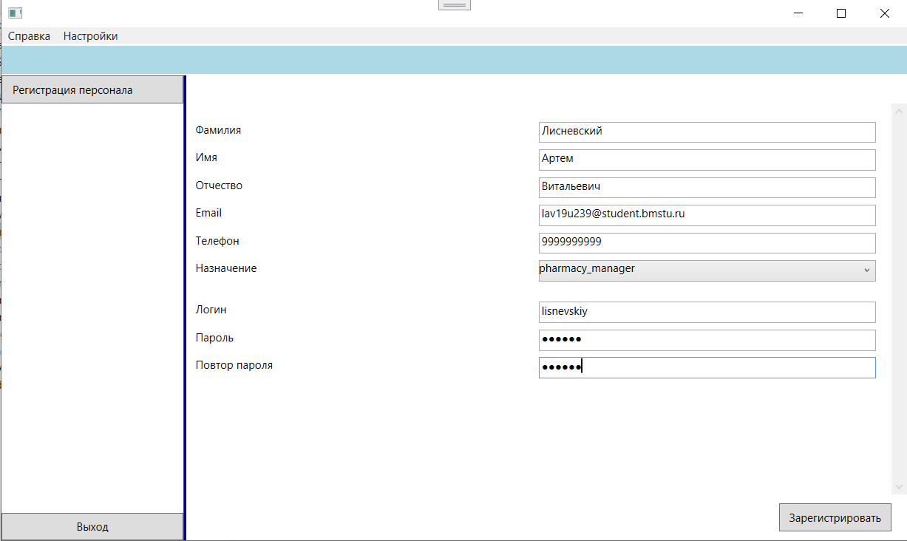

Страница с принятыми товарами (грузчик)

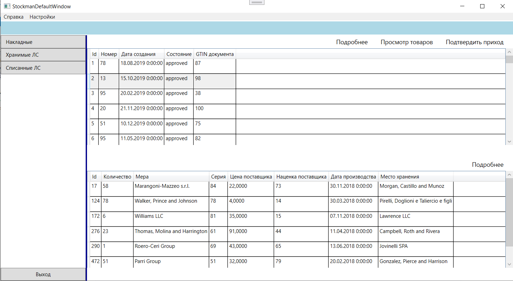

Страница с местоположением принятого товара

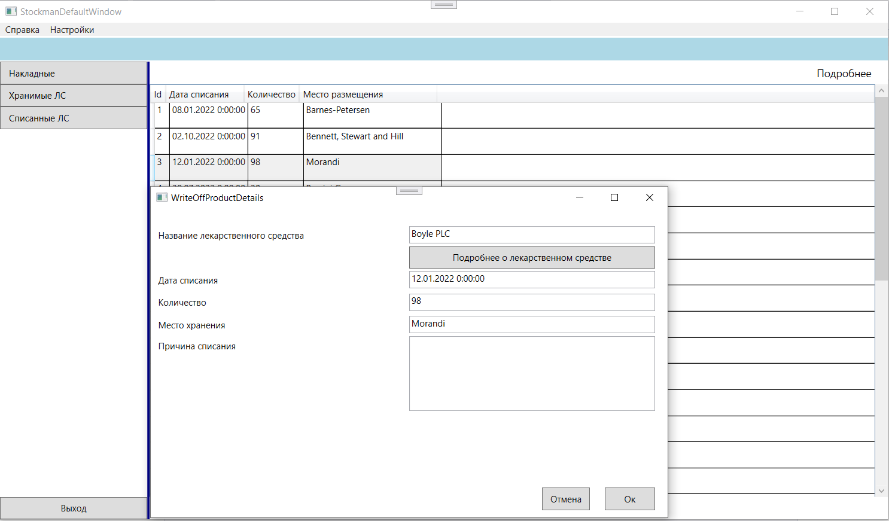

Страница списания товара со склада

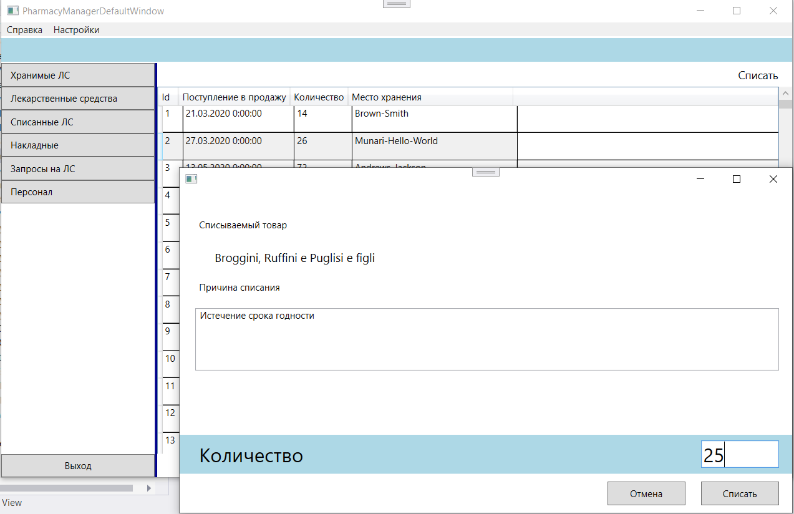

Страница с лекарственными средствами, хранимыми на складе (менеджер)

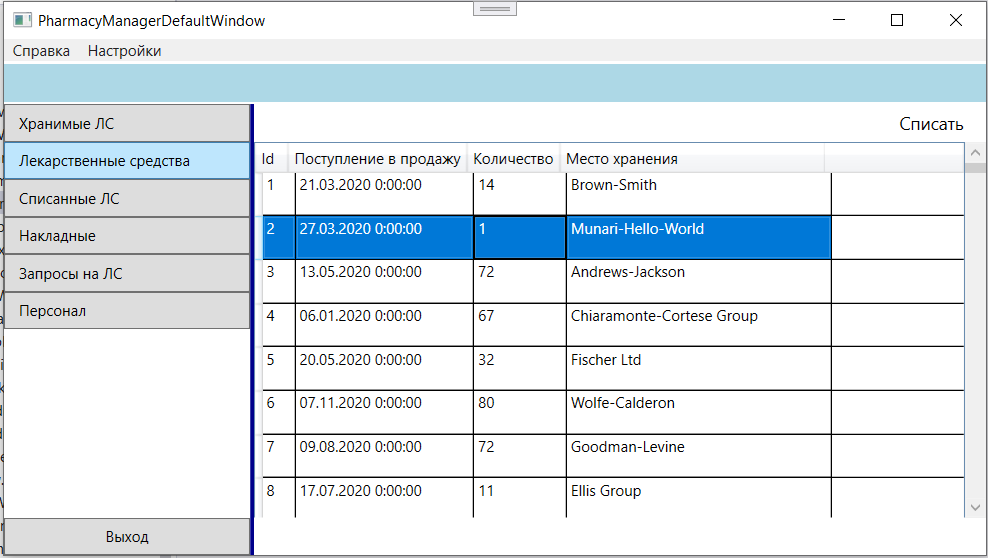

Страница с оформление чека (фармацевт)

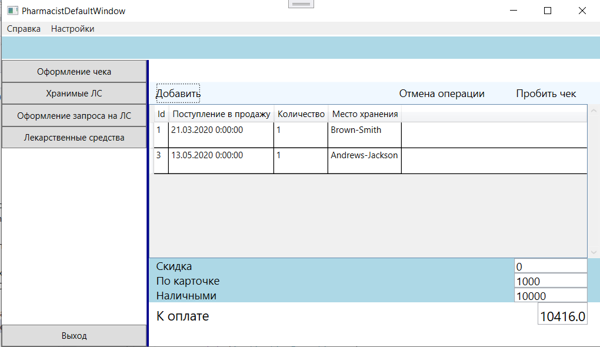
